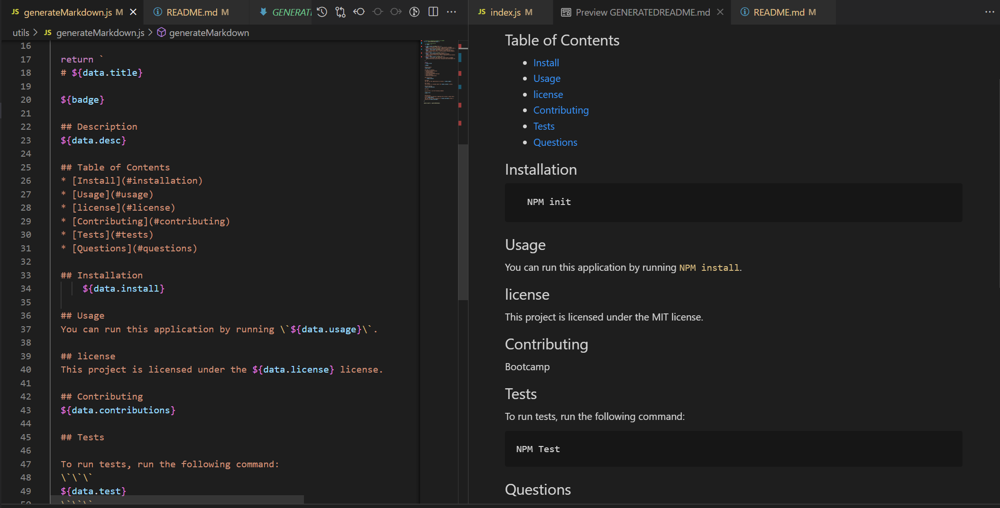

# README Generator

[](https://opensource.org/licenses/MIT)
## Table of Contents 
* [Description](#description​)

* [Screenshot](#screenshot)

* [Installation](#installation)

* [License](#license)
​
* [Usage](#usage)
​
* [Contributing](#contributing)

* [Tests](#tests)

* [Video](#video)

* [Links](#links)

## Description​

A simple application using Node.js, that generates a professional looking readme file using the command line.

The user is able to cycle through a selection of questions, that upon completion writes a .md file named 'GENERATEDREADME' to the dist folder.

This application uses the File System to access the command line and write the new file. The inquirer package is added for user input functionality to run the questions through the prompt.

Create your professional README file from scratch the **_easy way_**!

## Screenshot


​
## Installation
​
To install the necessary dependencies, run the following command:
​
```
npm install
```

## Usage
​
To start the generation process, type `node index.js`.
​
## License


This project is licensed under the MIT License

    
## Contributing
​
Fork and pull request.
​
## Tests
​
To run tests, run the following command:
​
```
npm test
```

## Video
[Here](https://link.com) is a walkthrough video of the process

## Links
This Github Repo can be found [here](https://github.com/nattytatat/readme-generator)

